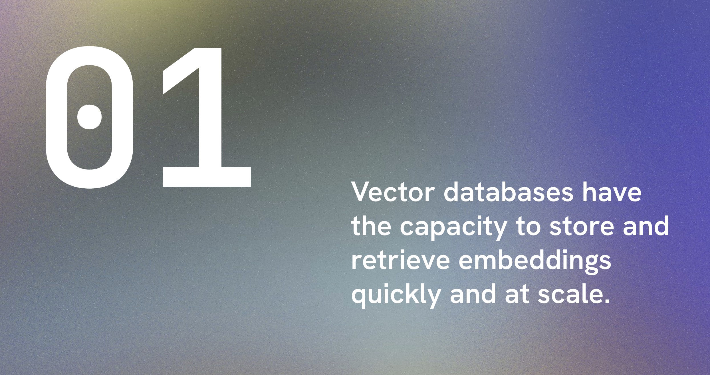
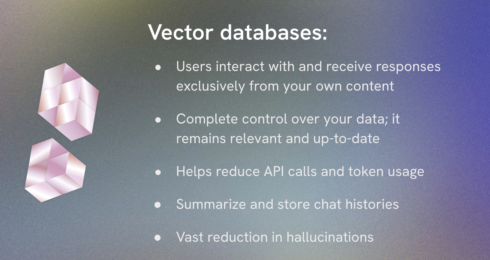
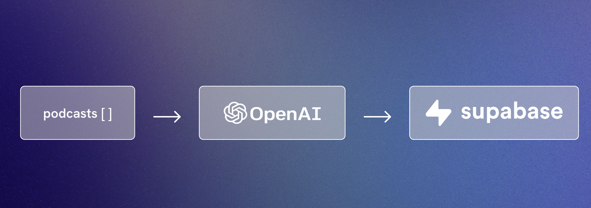
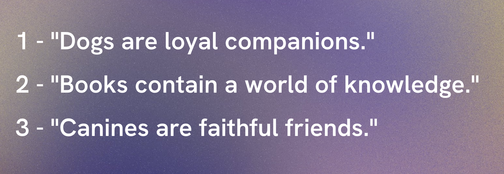
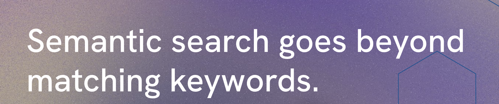
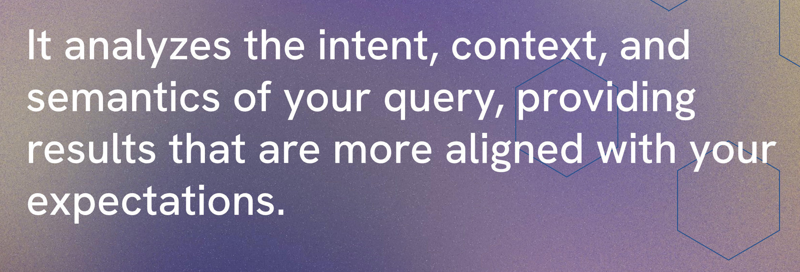
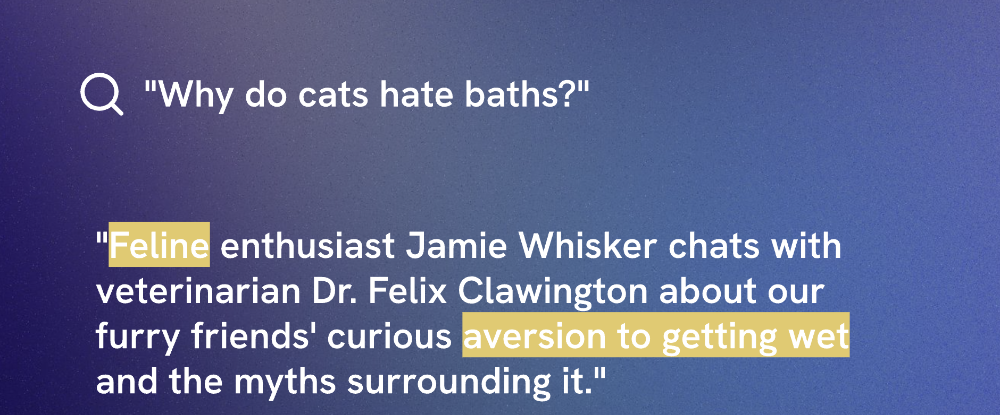
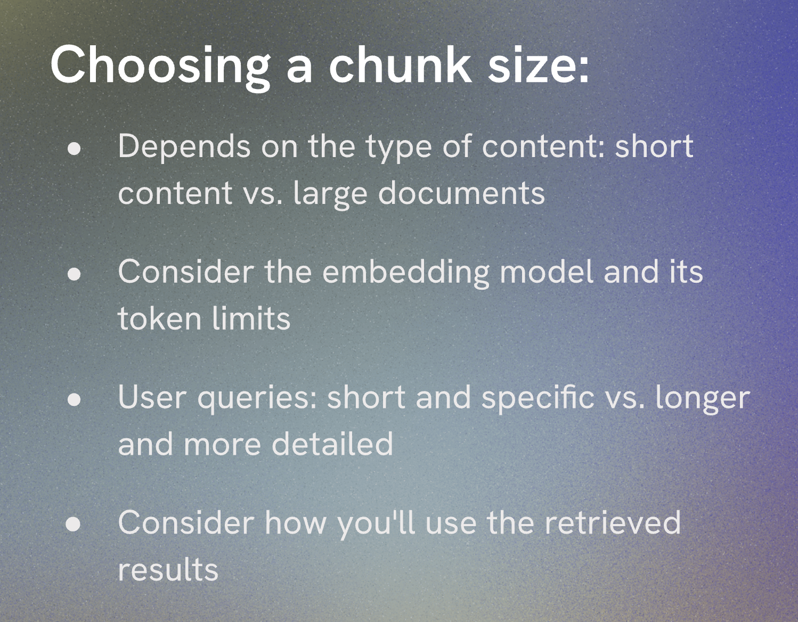
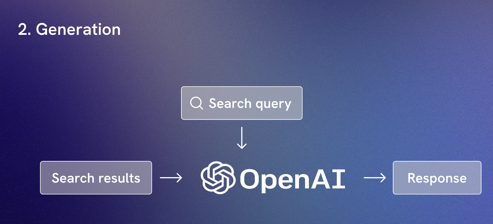

# Getting Started

Install the dependencies and run the project

```

npm install
npm start

```

Creating embeddings  
https://platform.openai.com/docs/api-reference/embeddings


## Vector Databases



instead of looking for exact matches,  
they use a similarity matches about the meaning of the words and phrases to find the vectors more similars



chroma pinecone supabase

### Store vector embeddings / set up vector database

https://supabase.com/

postgres pgvector

enable pgvector extension in supabase  
copy url postgres

https://supabase.com/blog/openai-embeddings-postgres-vector

```sql
create table documents (
  id bigserial primary key,
  content text,
  embedding vector(1536)
);
```


[https://supabase.com/dashboard/project/enhchksytrfzdigyjodl/editor/17578](https://supabase.com/dashboard/project/enhchksytrfzdigyjodl/editor/17578)

to run each js file
`node <name-js-file>.js`

### Semantic search






seaching by meaning and relationships

[https://supabase.com/docs/guides/ai/vector-columns](https://supabase.com/docs/guides/ai/vector-columns)

```sql
create or replace function match_documents (
  query_embedding vector(384),
  match_threshold float,
  match_count int
)
returns table (
  id bigint,
  title text,
  body text,
  similarity float
)
language sql stable
as $$
select
  documents.id,
  documents.title,
  documents.body,
  1 - (documents.embedding <=> query_embedding) as similarity
from documents
where 1 - (documents.embedding <=> query_embedding) > match_threshold
order by (documents.embedding <=> query_embedding) asc
limit match_count;
$$;
```

## Chunking text from documents


langchang

```
npm install @langchain/core @langchain/langgraph @langchain/openai @langchain/community
```

[https://js.langchain.com/docs/introduction/](https://js.langchain.com/docs/introduction/)



shorter chunks captures precise meanings but it might miss wider context
longer chunks grasp more context but can produce too broad a scope of information

optimize for the smallest size without losing context

## 6 challenge

\-- Create a table to store your documents

```sql
create table movies (
  id bigserial primary key,
  content text, -- corresponds to Document.pageContent
  metadata jsonb, -- corresponds to Document.metadata
  embedding vector(1536) -- 1536 works for OpenAI embeddings, change if needed
);
```

\-- Create a function to search for documents

```sql
create or replace function match_movies (
  query_embedding vector(1536),
  match_threshold float,
  match_count int
)
returns table (
  id bigint,
  content text,
  similarity float
)
language sql stable
as $$
select
  movies.id,
  movies.content,
  1 - (movies.embedding <=> query_embedding) as similarity
from movies
where 1 - (movies.embedding <=> query_embedding) > match_threshold
order by similarity desc
limit match_count;
$$;
```

## RAG

retrieval -> generation



